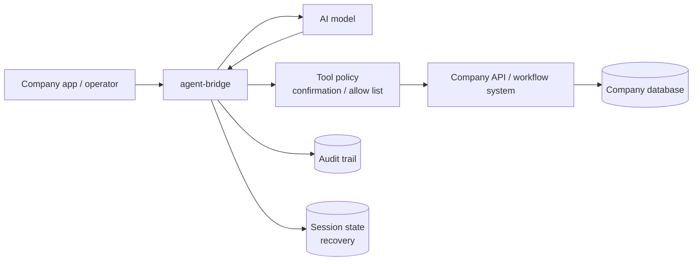

# agent-bridge

agent-bridge is a safe runtime for connecting AI agents to company tools, workflows, and APIs.

- License: [MIT](./LICENSE)
- Security policy: [SECURITY.md](./SECURITY.md)
- Contributing: [CONTRIBUTING.md](./CONTRIBUTING.md)

It is not a chatbot template, and it is not a replacement for your existing workflow engine, database, CRM, ticketing system, or internal platform. It provides the runtime layer that lets an AI model use those systems through controlled tools.

## What this project does

agent-bridge gives you a configurable backend for enterprise agent use cases:

- **Model adapter**: use a mock model for local demos or OpenAI for real model calls.
- **Connector system**: expose company APIs as tools through configuration.
- **Tool calling runtime**: let the model decide when to call a tool.
- **Human confirmation**: pause risky tool calls until a human approves or rejects them.
- **Session state**: persist messages, snapshots, confirmations, grants, and tool executions.
- **Recovery**: resume interrupted sessions and pending confirmations after restart.
- **Audit trail**: record API access, tool execution, approval decisions, and failures.
- **HTTP API and minimal console**: operate the runtime from an API or browser.

## What this project does not do

agent-bridge does not automatically know your company business. You tell it what your company systems can do by writing a `project.yaml` file.

It also should not bypass your existing business systems:

- Do not let the agent write directly to production databases.
- Prefer calling existing business APIs or workflow APIs.
- Keep your workflow engine as the source of truth for business approvals.
- Use agent-bridge confirmation to approve whether the agent may trigger an external action.

## Current status

This repository is an early enterprise-agent runtime. It is suitable for demos, internal evaluation, and controlled prototypes.

Current built-in capabilities:

- `custom / mock-model` for local demos without an API key
- `openai` model provider
- `echo` connector
- configurable REST `api` connector
- session / confirmation / resume HTTP APIs
- SQLite persistence
- structured audit logs
- configurable sensitive-field redaction for API responses, exports, and audit logs
- startup project config validation
- minimal web console at `/`

## Architecture



agent-bridge keeps the company system as the source of truth. The model can reason and request tool calls, but writes still go through configured APIs, policy checks, approvals, and audit logs.

## Docker quickstart

Run the training-analysis demo with one command:

```bash
docker compose up --build
```

Open:

```text
http://127.0.0.1:3000/
```

The compose file starts:

- `agent-bridge` on port `3000`
- a mock company training API on port `4020`
- persistent runtime data in the `agent_bridge_data` Docker volume

Try this prompt:

```text
analyze training data for USER-001
```

## Quickstart: run without any API key

```bash
npm install
npm run build
node dist/server-main.js --port 3000
```

Open:

```text
http://127.0.0.1:3000/
```

The default project uses:

```yaml
model:
  provider: custom
  model: mock-model
```

So you can test sessions, tool calls, confirmations, recovery, and audit behavior without configuring `OPENAI_API_KEY`.

## Run a realistic company API example

This repository includes a runnable ticket-system example:

```bash
# terminal 1: start a mock company ticket API
node examples/company-ticket-agent/mock-api.mjs

# terminal 2: start agent-bridge with the ticket example project
npm run build
$env:TICKET_API_TOKEN='example-ticket-token'
node dist/server-main.js --project examples/company-ticket-agent/project.yaml --port 3000
```

Open:

```text
http://127.0.0.1:3000/
```

Then:

1. Click **New Session**.
2. Run a prompt such as:

```text
create comment for ticket TICKET-001
```

3. The runtime should enter `waiting_confirmation`.
4. Click **Approve**.
5. The agent calls the mock company API and records the execution and audit trail.

See [`examples/company-ticket-agent/README.md`](./examples/company-ticket-agent/README.md).

## Run an existing workflow-system example

This example shows the recommended boundary when your company already has a workflow engine:

```bash
# terminal 1: start a mock company workflow API
node examples/company-workflow-agent/mock-api.mjs

# terminal 2: start agent-bridge with the workflow example project
$env:WORKFLOW_API_TOKEN='example-workflow-token'
node dist/server-main.js --project examples/company-workflow-agent/project.yaml --port 3000
```

See [`examples/company-workflow-agent/README.md`](./examples/company-workflow-agent/README.md).

## Run a training-data analysis example

This example matches a common enterprise workflow: fetch a user's training statistics, ask AI to analyze the data against a configured standard, then save the structured result through a company API.

```bash
# terminal 1: start a mock company training API
node examples/training-analysis-agent/mock-api.mjs

# terminal 2: start agent-bridge with the training analysis project
$env:TRAINING_API_BASE_URL='http://127.0.0.1:4020'
$env:TRAINING_API_TOKEN='example-training-token'
node dist/server-main.js --project examples/training-analysis-agent/project.yaml --port 3000
```

Try this prompt in the console:

```text
analyze training data for USER-001
```

The read tool `get_training_stats` runs without approval. The write tool `save_training_analysis` has a tool-specific confirmation rule and enters `waiting_confirmation` before the result is saved.

See [`examples/training-analysis-agent/README.md`](./examples/training-analysis-agent/README.md).

## Use a real model

Create `.env` from the template:

```bash
cp .env.example .env
```

Set:

```env
OPENAI_API_KEY=your_openai_api_key_here
```

Then run with an OpenAI project config:

```bash
npm run build
node dist/server-main.js --project projects/example/openai-project.yaml --port 3000
```

For a real training-analysis chain, start the mock training API and use the OpenAI template:

```bash
node examples/training-analysis-agent/mock-api.mjs
OPENAI_API_KEY=your_openai_api_key_here \
TRAINING_API_BASE_URL=http://127.0.0.1:4020 \
TRAINING_API_TOKEN=example-training-token \
node dist/server-main.js --project projects/example/training-openai-api.yaml --port 3000
```

A project config can also use an OpenAI-compatible gateway with `baseUrl` and a model request timeout:

```yaml
model:
  provider: openai
  model: gpt-4o-mini
  envApiKey: OPENAI_API_KEY
  baseUrl: https://api.openai.com/v1
  timeoutMs: 60000
```

## Connect your own REST API in 5 minutes

1. Create a project file, for example `projects/my-company/project.yaml`.

2. Choose a model. Use `mock-model` for a no-key smoke test, or `openai` for real model calls.

```yaml
model:
  provider: custom
  model: mock-model
```

3. Add your company API as a connector.

```yaml
connectors:
  - id: company-api
    type: api
    name: Company API
    config:
      baseUrl: ${COMPANY_API_BASE_URL}
      timeoutMs: 30000
      auth:
        type: bearer
        token: ${COMPANY_API_TOKEN}
      tools:
        - name: get_customer_profile
          description: Get customer profile by id.
          method: GET
          path: /customers/profile
          queryParams: [customerId]
          parameters:
            customerId:
              type: string
              description: Customer id.
              required: true

        - name: save_customer_analysis
          description: Save an AI-generated customer analysis result.
          method: POST
          path: /customers/analysis
          bodyParams: [customerId, summary, riskLevel, recommendations]
          parameters:
            customerId:
              type: string
              description: Customer id.
              required: true
            summary:
              type: string
              description: Human-readable analysis summary.
              required: true
            riskLevel:
              type: string
              description: Risk level.
              enum: [low, medium, high]
              required: true
            recommendations:
              type: array
              description: Suggested next actions.
              required: true
              items:
                type: string
                description: One recommendation.
```

4. Optional: define analysis standards as configuration instead of hard-coding them in code.

```yaml
analysis:
  standardId: customer-risk-v1
  levels:
    - level: low_risk
      riskLevel: low
      when:
        overdueInvoices:
          eq: 0
        healthScore:
          gte: 80
      recommendations:
        - Keep the current customer success cadence.
  fallback:
    level: needs_attention
    riskLevel: high
    recommendations:
      - Ask a human owner to review this customer.
```

5. Define the safety boundary. A common pattern is to require approval only for write tools.

```yaml
toolPolicy:
  maxConsecutiveCalls: 6
  confirmationTimeoutMs: 900000
  confirmationRules:
    - tool: save_customer_analysis
      requireConfirmation: true
```

6. Start the server.

```bash
npm run build
COMPANY_API_BASE_URL=https://api.company.example \
COMPANY_API_TOKEN=your-token \
node dist/server-main.js --project projects/my-company/project.yaml --port 3000
```

Open `http://127.0.0.1:3000/`, create a session, and ask the agent to use the company tool. Read calls can run directly; write calls pause in `waiting_confirmation` until approved.

## Project configuration model

A project is defined by a YAML or JSON file:

```yaml
id: company-ticket-agent
name: Company Ticket Agent

model:
  provider: openai
  model: gpt-4o-mini
  envApiKey: OPENAI_API_KEY
  timeoutMs: 60000

analysis:
  standardId: customer-risk-v1
  levels:
    - level: healthy
      riskLevel: low
      when:
        healthScore:
          gte: 80
  fallback:
    level: needs_attention
    riskLevel: high

connectors:
  - id: company-api
    type: api
    name: Company API
    config:
      baseUrl: https://api.company.example
      timeoutMs: 30000
      auth:
        type: bearer
        token: ${COMPANY_API_TOKEN}
      tools:
        - name: get_ticket
          description: Get ticket details by ticket id
          method: GET
          path: /tickets/detail
          queryParams: [ticketId]
          parameters:
            ticketId:
              type: string
              description: Ticket id
              required: true

toolPolicy:
  maxConsecutiveCalls: 5
  confirmationTimeoutMs: 900000
  confirmationRules:
    - tool: save_customer_analysis
      requireConfirmation: true
```

Tool parameters support strict schemas, including `enum`, nested object `properties`, and array `items`. Invalid model output is rejected before a company write API is called.

`toolPolicy.confirmationTimeoutMs` controls how long a pending human approval stays valid. It is measured in milliseconds and defaults to `900000` when omitted.

Use `security.redaction` when your company has domain-specific sensitive fields that are not covered by the built-in token/password/secret rules:

```yaml
security:
  redaction:
    extraSensitiveKeys:
      - employeeIdCard
      - mobile_phone
      - nationalId
    replacement: '[REDACTED]'
```

These rules are applied before API responses, exports, and audit logs leave the runtime.

The project file tells agent-bridge:

- which model to use, including OpenAI-compatible `baseUrl` and `timeoutMs`
- which company systems are connected
- which tools are available
- which configurable analysis standards should be injected into the model context
- how risky tool calls should be confirmed
- how long session memory should be kept

## REST API connector

The built-in `api` connector maps REST endpoints to agent tools.

Supported today:

- HTTP methods: `GET`, `POST`, `PUT`, `PATCH`, `DELETE`
- query parameters
- JSON body parameters
- static headers
- bearer token auth
- API key auth
- JSON response parsing
- request timeout control with connector-level or tool-level `timeoutMs` values; default is `30000`
- method-based risk inference: `GET` = low, `POST/PUT/PATCH` = medium, `DELETE` = high

Project config supports `${ENV_VAR}` interpolation in string values, including connector secrets. If a referenced variable is missing, startup fails with `PROJECT_CONFIG_ENV_VAR_MISSING`. For production systems, still prefer a secret manager or environment-specific deployment config.

## HTTP API auth

HTTP API authentication is optional. Enable it with:

```env
API_AUTH_ENABLED=true
API_AUTH_TOKENS=viewer-token:viewer-1:viewer,operator-token:operator-1:operator,approver-token:approver-1:approver
```

Token format:

```text
token:actorId:role
```

Roles:

- `viewer`: read-only APIs
- `operator`: create and run sessions
- `approver`: approve or reject confirmations
- `admin`: full access

The web console has a **Bearer token** input for calling protected APIs.

## Core concepts

- **Project**: one agent configuration for one business context.
- **Connector**: an adapter that exposes company capabilities.
- **Tool**: a callable business operation exposed to the model.
- **Session**: a stateful conversation and execution timeline.
- **Confirmation**: a human approval gate before risky execution.
- **Grant**: a persisted approval that lets a specific tool call continue.
- **Audit event**: a structured record of API access, tool execution, approval, rejection, or failure.

## Recommended integration patterns

### 1. Existing REST APIs

Expose each safe business operation as one tool. Start with read-only APIs, then add write APIs behind confirmation.

### 2. Existing workflow engines

Do not replace the workflow engine. Let the agent prepare input and call `start_workflow`, `get_workflow_status`, or `add_workflow_comment` APIs.

### 3. Databases

Avoid direct write access to production databases. Prefer read-only APIs, read replicas, analytics APIs, or a restricted query gateway.

### 4. Internal SDKs

If your company already has an SDK, write a custom connector that wraps the SDK and exposes a small set of safe tools.

## Documentation

- [Integration guide](./docs/integration-guide.md)
- [Security model](./docs/security-model.md)
- [HTTP API reference](./docs/api.md)
- [Error codes](./docs/error-codes.md)
- [Deployment checklist](./docs/deployment-checklist.md)
- [Examples](./examples/README.md)

## Development

```bash
npm install
npm run build
npm run test:run
```

Current full regression target:

```text
12 test files / 117 tests
```

## Roadmap

Near-term priorities:

- clearer connector contract
- stronger secret redaction and production hardening
- more official examples: readonly data, OpenAI + company API
- stronger project config validation
- safer production defaults
- improved console onboarding

## License

MIT
