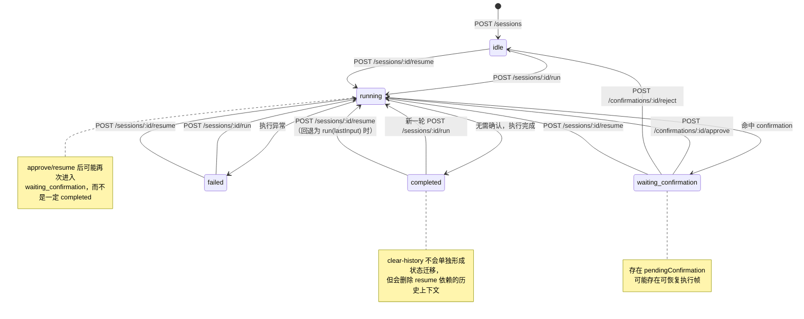

# API 文档

## 快速导航

如果你是第一次接入，建议按下面顺序阅读：

1. [API 一页速查表](#api-cheatsheet)
2. [API 鉴权与角色](#api-auth-and-roles)
3. [最常用的判断规则](#common-rules)
4. [HTTP 调用示例](#http-examples)
5. [审计事件](#audit-events)
6. [常见错误与边界场景](#common-errors)
7. [前端集成伪代码](#frontend-pseudocode)
8. [Mermaid 状态机图](#mermaid-state-diagram)

如果你只关心几个最关键的边界，请优先确认这些结论：

- `approve` 会继续推进执行，不只是记录“已批准”
- `resume` 优先恢复持久化的 tool-call frame；恢复不了才回退到 `run(lastInput)`
- `clear-history` 会破坏 `resume` 依赖的历史上下文
- `/grants` 为空，不代表历史上从未批准过

## 目录

- [Session / Confirmation API 语义](#session-confirmation-api)
  - [核心接口](#core-endpoints)
  - [API 一页速查表](#api-cheatsheet)
  - [API 鉴权与角色](#api-auth-and-roles)
  - [角色与接口权限对照](#role-endpoint-matrix)
  - [最常用的判断规则](#common-rules)
  - [状态语义](#状态语义)
  - [`approve` 的真实语义](#approve-semantics)
  - [`resume` 的真实语义](#resume-semantics)
  - [`clear-history` 的边界](#clear-history-boundary)
  - [`grants` 的语义](#grants-semantics)
  - [推荐调用流程](#recommended-flows)
    - [场景 A：一次运行直接完成](#flow-a-direct-complete)
    - [场景 B：运行被 confirmation 中断](#flow-b-confirmation-interrupted)
    - [场景 C：批准后稍后恢复](#flow-c-resume-later)
  - [HTTP 调用示例](#http-examples)
    - [示例 1：`run -> waiting_confirmation -> approve -> completed`](#example-run-approve-complete)
    - [示例 2：查询待确认请求，再执行 approve](#example-query-pending-then-approve)
    - [示例 3：保留历史时使用 `resume`](#example-resume-with-history)
  - [审计事件](#audit-events)
    - [HTTP 审计事件](#http-audit-events)
    - [运行时审计事件](#runtime-audit-events)
    - [如何理解 waiting_confirmation 与 failed](#waiting-vs-failed-audit)
  - [常见错误与边界场景](#common-errors)
  - [前端集成伪代码](#frontend-pseudocode)
  - [Mermaid 状态机图](#mermaid-state-diagram)

<a id="session-confirmation-api"></a>
## Session / Confirmation API 语义

HTTP API 已支持基于 session 的运行、确认、恢复与状态查询。对于会产生副作用或高风险的工具，推荐调用方显式处理 confirmation 流，而不是假定一次 `run` 一定直接完成。

<a id="core-endpoints"></a>
### 核心接口

- `POST /sessions`：创建 session
- `POST /sessions/:id/run`：提交用户输入并运行
- `POST /sessions/:id/resume`：恢复先前被 confirmation 中断的执行
- `POST /sessions/:id/clear-history`：清空消息历史，仅保留 system message
- `GET /sessions`：按条件查询 session 列表
- `GET /sessions/export`：导出 session 列表
- `GET /sessions/:id/messages`：查看当前消息历史
- `GET /sessions/:id/pending-confirmations`：查看待确认请求
- `GET /sessions/:id/confirmations`：查看当前 session 的 confirmation 请求历史 / 分页查询
- `GET /sessions/:id/confirmation-decisions`：查看当前 session 的审批决策记录
- `GET /sessions/:id/grants`：查看当前未消费的 approval grants
- `GET /sessions/:id/tool-executions`：查看当前 session 的工具执行审计记录
- `GET /sessions/:id/audit-events`：查看当前 session 的 API / 运行时审计事件
- `GET /sessions/:id/state-summary`：查看 session 摘要
- `GET /confirmations`：按条件查询全局 confirmation 请求
- `GET /confirmations/decisions`：按条件查询全局审批决策记录
- `GET /audit-events`：按条件查询全局审计事件
- `GET /metrics`：查看系统级运行摘要指标
- `POST /confirmations/:id/approve`：批准某个确认请求，并继续执行
- `POST /confirmations/:id/reject`：拒绝某个确认请求

<a id="api-cheatsheet"></a>
### API 一页速查表

| 方法 | 路径 | 用途 | 典型返回 / 状态 | 关键提醒 |
| --- | --- | --- | --- | --- |
| `POST` | `/sessions` | 创建新 session | `200`，返回 `sessionId` | 后续所有操作都依赖这个 `sessionId` |
| `POST` | `/sessions/:id/run` | 提交一次用户输入并执行 | `completed` 或 `waiting_confirmation` | 不要假设一定一次完成 |
| `POST` | `/sessions/:id/resume` | 尝试恢复先前中断的执行 | `completed` 或 `waiting_confirmation` | 优先恢复 tool-call frame；没有恢复帧时会退回 `run(lastInput)` |
| `POST` | `/sessions/:id/clear-history` | 清空消息历史，仅保留 system message | `200`，返回 `cleared: true` | 会破坏 `resume` 依赖的历史上下文 |
| `GET` | `/sessions` | 查询 session 列表 | `200`，返回 `records/total/hasMore` | 支持按 `projectId/status/时间` 过滤与分页，并内置 summary 字段 |
| `GET` | `/sessions/export` | 导出 session 列表 | `200`，返回 `jsonl` 或 `csv` | 适合后台列表导出与离线分析 |
| `GET` | `/sessions/:id/messages` | 查看当前消息历史 | `200`，返回 `messages` | 适合调试与 UI 回显 |
| `GET` | `/sessions/:id/pending-confirmations` | 查看当前待确认项 | `200`，返回 `pendingConfirmations` | 人工审批列表优先用它 |
| `GET` | `/sessions/:id/confirmations` | 查询当前 session 的 confirmation 历史 | `200`，返回 `records/total/hasMore` | 支持按 `tool/riskLevel/status/时间` 过滤 |
| `GET` | `/sessions/:id/confirmation-decisions` | 查询当前 session 的审批决策记录 | `200`，返回 `records/total/hasMore` | 这是审批历史，不是待办列表 |
| `GET` | `/sessions/:id/grants` | 查看未消费的批准记录 | `200`，返回 `approvalGrants` | 为空不代表从未批准过 |
| `GET` | `/sessions/:id/tool-executions` | 查看工具执行审计记录 | `200`，返回 `toolExecutions` | 适合排查工具执行过程与结果 |
| `GET` | `/sessions/:id/audit-events` | 查看当前 session 的审计事件 | `200`，返回过滤后的 `events` | 聚合同一 session 的 HTTP 与运行时审计 |
| `GET` | `/sessions/:id/state-summary` | 查看 session 摘要信息 | `200`，返回状态统计摘要 | 适合总览和诊断 |
| `GET` | `/confirmations` | 查询全局 confirmation 请求 | `200`，返回 `records/total/hasMore` | 支持按 `sessionId/projectId/tool/riskLevel/status` 过滤 |
| `GET` | `/confirmations/decisions` | 查询全局审批决策记录 | `200`，返回 `records/total/hasMore` | 审批历史总表优先看它 |
| `GET` | `/audit-events` | 查询全局审计事件 | `200`，返回 `events/total/hasMore` | 支持按 actor、action、result、时间范围过滤；优先查持久化历史，未配置时回退到 queryable sink |
| `GET` | `/metrics` | 查看系统级运行摘要指标 | `200`，返回 `metrics` | 支持 `projectId/from/to`，适合内测阶段的基础观测与巡检 |
| `POST` | `/confirmations/:id/approve` | 批准某个确认请求 | `completed` 或 `waiting_confirmation` | approve 会继续推进流程，不只是记日志 |
| `POST` | `/confirmations/:id/reject` | 拒绝某个确认请求 | `200`，返回 `rejected: true` | 当前实现会结束该待确认动作 |

<a id="api-auth-and-roles"></a>
### API 鉴权与角色

HTTP API 支持可选的 Bearer token 鉴权。未开启鉴权时，所有路由按当前服务默认行为开放；开启后，除 `GET /health` 外，其余接口都需要携带 `Authorization: Bearer <token>`。

通过环境变量启用：

```env
API_AUTH_ENABLED=true
API_AUTH_TOKENS=viewer-token:viewer-1:viewer,operator-token:operator-1:operator,approver-token:approver-1:approver
```

其中 `API_AUTH_TOKENS` 的格式为：

```text
token:actorId:role
```

角色说明：

- `viewer`：只读访问，适合查看 project / session / messages / pending confirmations / grants / tool executions / audit events / state summary
- `operator`：可创建 session、提交 `run`、执行 `resume`、清理历史
- `approver`：可执行 confirmation 的 `approve` / `reject`
- `admin`：拥有所有接口权限

请求示例：

```bash
curl -H "Authorization: Bearer operator-token" \
  -H "Content-Type: application/json" \
  -X POST http://127.0.0.1:3000/sessions/session-123/run \
  -d '{"input":"请创建评论"}'
```

如果 token 缺失、格式错误、值无效或角色不足，服务会返回结构化错误，例如：

```json
{
  "error": {
    "code": "AUTH_REQUIRED",
    "message": "Authentication required",
    "requestId": "...",
    "retryable": false
  }
}
```

<a id="role-endpoint-matrix"></a>
### 角色与接口权限对照

| 接口 | 最低角色 |
| --- | --- |
| `GET /health` | 无需鉴权 |
| `GET /project` | `viewer` |
| `POST /sessions` | `operator` |
| `GET /sessions` / `GET /sessions/export` / `GET /sessions/:id` | `viewer` |
| `GET /sessions/:id/messages` | `viewer` |
| `GET /sessions/:id/pending-confirmations` | `viewer` |
| `GET /sessions/:id/confirmations` | `viewer` |
| `GET /sessions/:id/confirmation-decisions` | `viewer` |
| `GET /sessions/:id/grants` | `viewer` |
| `GET /sessions/:id/tool-executions` | `viewer` |
| `GET /sessions/:id/audit-events` | `viewer` |
| `GET /sessions/:id/state-summary` | `viewer` |
| `GET /confirmations` | `viewer` |
| `GET /confirmations/decisions` | `viewer` |
| `GET /audit-events` | `viewer` |
| `GET /metrics` | `viewer` |
| `POST /sessions/:id/run` | `operator` |
| `POST /sessions/:id/resume` | `operator` |
| `POST /sessions/:id/clear-history` | `operator` |
| `POST /confirmations/:id/approve` | `approver` |
| `POST /confirmations/:id/reject` | `approver` |


<a id="common-rules"></a>
### 最常用的判断规则

- 看到 `status === completed`：说明本轮已经结束
- 看到 `status === waiting_confirmation`：说明需要继续处理 `pendingConfirmation`
- 看到 `/grants` 为空：只代表“没有未消费批准”，不代表“从未发生过批准”
- 调用 `clear-history` 之后：通常不要再期待 `resume` 能从原确认点继续

### 状态语义

常见返回状态：

- `completed`：当前这次运行已完成
- `waiting_confirmation`：运行被工具确认流程中断，等待批准或拒绝
- `failed`：运行失败

其中 `run`、`resume`、`approve` 的响应体都遵循同一结构：

```json
{
  "sessionId": "...",
  "status": "completed | waiting_confirmation",
  "result": {
    "response": "...",
    "messages": [],
    "toolCalls": [],
    "pendingConfirmation": {
      "id": "...",
      "tool": "create_comment"
    }
  }
}
```

<a id="approve-semantics"></a>
### `approve` 的真实语义

`POST /confirmations/:id/approve` 不只是记录“同意”。当前实现会在批准后，优先尝试继续那次被 confirmation 打断的工具调用。

也就是说，推荐调用方把它理解为：

1. 批准该 confirmation
2. 若 session 中仍保留可恢复执行帧，则立即继续执行
3. 返回新的运行结果：可能是 `completed`，也可能再次进入 `waiting_confirmation`

因此，调用方不应假设 approve 之后一定还要手动再调一次 `run`。

<a id="resume-semantics"></a>
### `resume` 的真实语义

`POST /sessions/:id/resume` 的优先级是：

1. **优先恢复已持久化的 tool-call frame**
   - 如果 session 中仍保留最近一次被中断的 assistant `toolCalls`
   - 并且存在待确认请求或可匹配的 approval grant
   - 则从该确认点继续执行，而不是重新请求模型

2. **若没有可恢复帧，再回退到 `run(lastInput)` 语义**
   - 即按最近一次输入重新运行

这意味着当前的 `resume` 更准确的定义是：

> 基于已持久化 tool-call frame 的恢复执行

而不是通用意义上的任意检查点恢复系统。

<a id="clear-history-boundary"></a>
### `clear-history` 的边界

`POST /sessions/:id/clear-history` 会清空消息历史，仅保留 system message。这个操作会同时移除恢复执行所依赖的 assistant/tool 上下文。

因此要特别注意：

- **保留历史**：可以继续使用 `resume` 从确认中断点恢复
- **清空历史后**：通常不能再从原确认点继续，只能退回普通的 `run(lastInput)` 语义

如果你的产品希望支持“审批后稍后再继续”，就不要在 resume 前调用 `clear-history`。

<a id="confirmation-query-semantics"></a>
### confirmation 查询视角的区别

confirmation 相关接口现在可以分成四类，它们不是同一个列表的不同别名：

- `GET /sessions/:id/pending-confirmations`
  - 只返回**当前仍待处理**的 confirmation
  - 适合做人工审批待办列表
- `GET /sessions/:id/confirmations` / `GET /confirmations`
  - 返回 confirmation request 的**历史记录视图**
  - 可按 `status`、`riskLevel`、`tool`、时间范围等筛选
  - 适合审计“这个请求曾经是否出现过、现在是什么状态”
- `GET /sessions/:id/confirmation-decisions` / `GET /confirmations/decisions`
  - 返回审批动作本身的**决策历史**（approved / rejected）
  - 适合回答“谁在什么时候批准/拒绝了哪个请求”
- `GET /sessions/:id/grants`
  - 返回**尚未消费**的 approval grant
  - 它表示“已经批准，且还能用于恢复执行”，不是审批历史总表

一个常见误区是把 `/grants` 当作“已批准列表”。更准确地说：

- 要看**当前待办**：看 `pending-confirmations`
- 要看**请求生命周期**：看 `confirmations`
- 要看**审批动作历史**：看 `confirmation-decisions`
- 要看**还能不能继续恢复执行**：看 `grants`

<a id="grants-semantics"></a>
### `grants` 的语义

approval grant 表示“某个 confirmation 已被批准，但对应工具调用尚未被消费完”。

- 如果批准后立即续跑成功，grant 通常会被立刻消费，此时 `/grants` 可能为空
- 如果批准已记录，但实际恢复执行尚未发生，`/grants` 会返回该 grant

因此，`GET /sessions/:id/grants` 更适合被理解为“尚可用于恢复执行的批准记录”，而不是历史审批列表。

<a id="recommended-flows"></a>
### 推荐调用流程

<a id="flow-a-direct-complete"></a>
#### 场景 A：一次运行直接完成

1. `POST /sessions`
2. `POST /sessions/:id/run`
3. 收到 `completed`

<a id="flow-b-confirmation-interrupted"></a>
#### 场景 B：运行被 confirmation 中断

1. `POST /sessions`
2. `POST /sessions/:id/run`
3. 收到 `waiting_confirmation`
4. `POST /confirmations/:id/approve`
5. 根据返回结果继续处理：
   - `completed`：本轮结束
   - `waiting_confirmation`：进入下一轮确认

<a id="flow-c-resume-later"></a>
#### 场景 C：批准后稍后恢复

1. `POST /sessions/:id/run`
2. 收到 `waiting_confirmation`
3. 外部系统记录审批结果
4. 在保留历史的前提下调用 `POST /sessions/:id/resume`

如果你的业务要支持“先审核、后恢复”，请避免在恢复前清理该 session 的消息历史。

<a id="http-examples"></a>
### HTTP 调用示例

下面示例假设服务已启动在 `http://127.0.0.1:3000`，并且当前 project 配置中存在会触发 confirmation 的工具，例如 `create_comment`。

<a id="example-run-approve-complete"></a>
#### 示例 1：`run -> waiting_confirmation -> approve -> completed`

1. 创建 session：

```bash
curl -X POST http://127.0.0.1:3000/sessions
```

示例响应：

```json
{
  "sessionId": "session-123"
}
```

2. 提交一次会触发确认的运行：

```bash
curl -X POST http://127.0.0.1:3000/sessions/session-123/run \
  -H "content-type: application/json" \
  -d '{"input":"请创建评论"}'
```

示例响应：

```json
{
  "sessionId": "session-123",
  "status": "waiting_confirmation",
  "result": {
    "response": "我准备调用 create_comment 工具，但这可能需要确认。",
    "toolCalls": [
      {
        "tool": "create_comment"
      }
    ],
    "pendingConfirmation": {
      "id": "confirmation-001",
      "tool": "create_comment"
    }
  }
}
```

3. 批准该 confirmation：

```bash
curl -X POST http://127.0.0.1:3000/confirmations/confirmation-001/approve \
  -H "content-type: application/json" \
  -d '{"reason":"approved by reviewer"}'
```

示例响应：

```json
{
  "sessionId": "session-123",
  "status": "completed",
  "result": {
    "response": "工具执行结果：{\"success\":true}",
    "toolCalls": [
      {
        "tool": "create_comment",
        "result": {
          "success": true
        }
      }
    ]
  }
}
```

这个例子体现的是：`approve` 会直接尝试继续执行，而不是只返回“已同意”。

<a id="example-query-pending-then-approve"></a>
#### 示例 2：查询待确认请求，再执行 approve

如果调用方没有在 `run` 响应里直接缓存 `pendingConfirmation.id`，也可以先查询：

```bash
curl http://127.0.0.1:3000/sessions/session-123/pending-confirmations
```

示例响应：

```json
{
  "sessionId": "session-123",
  "pendingConfirmations": [
    {
      "id": "confirmation-001",
      "tool": "create_comment",
      "riskLevel": "high"
    }
  ]
}
```

随后再调用：

```bash
curl -X POST http://127.0.0.1:3000/confirmations/confirmation-001/approve \
  -H "content-type: application/json" \
  -d '{"reason":"approved after manual review"}'
```

<a id="example-resume-with-history"></a>
#### 示例 3：保留历史时使用 `resume`

适用于“系统已经记录了批准结果，但恢复执行发生在稍后时刻”的场景。

前提是：与该中断 tool call 对应的 approval 已经被记录下来；否则 `resume` 仍可能再次回到 `waiting_confirmation`。

1. 先运行到 `waiting_confirmation`：

```bash
curl -X POST http://127.0.0.1:3000/sessions/session-123/run \
  -H "content-type: application/json" \
  -d '{"input":"请创建评论"}'
```

2. 外部系统完成审批记录后，在**保留当前消息历史**的前提下调用：

```bash
curl -X POST http://127.0.0.1:3000/sessions/session-123/resume
```

示例响应：

```json
{
  "sessionId": "session-123",
  "status": "completed",
  "result": {
    "toolCalls": [
      {
        "tool": "create_comment",
        "result": {
          "success": true
        }
      }
    ]
  }
}
```

注意：如果你在这之前调用了 `POST /sessions/session-123/clear-history`，那么原来的恢复帧通常已经不存在，`resume` 就可能退回为 `run(lastInput)` 语义，而不是从原确认点继续。

<a id="audit-events"></a>
### 审计事件

当前服务已经具备两类审计事件：

1. **HTTP 审计事件**：记录谁调用了哪个 API、是否成功、对应的 requestId / statusCode
2. **运行时审计事件**：记录某个 session 内工具何时开始、是否等待审批、是否成功完成、是否真实失败

如果你要做审批留痕、运行诊断、风控分析或内测问题回放，建议同时采集这两类事件，而不是只看 HTTP access log。

#### 审计查询接口

除了将审计事件输出到 console / file sink，HTTP API 还支持直接查询审计索引：

- `GET /audit-events`：查询全局审计事件
- `GET /audit-events/export`：导出全局审计事件
- `GET /sessions/:id/audit-events`：只查询某个 session 的审计事件
- `GET /sessions/:id/audit-events/export`：导出某个 session 的审计事件
- `GET /tool-executions`：查询全局工具执行记录
- `GET /tool-executions/export`：导出全局工具执行记录
- `GET /sessions/:id/tool-executions/export`：导出某个 session 的工具执行记录

查询数据源优先级：

1. **若已配置持久化 `auditEvents` repository**：优先查询可重启后保留的历史审计事件
2. **若未配置持久化，但 audit sink 可查询**：回退到内存 / queryable sink 的事件缓存

这意味着：

- 生产环境更推荐开启持久化审计，这样服务重启后仍能查询历史
- 轻量本地调试即使只有 `InMemoryApiAuditSink` 或 `FileApiAuditSink`，也仍可用查询接口做排障

支持的查询参数：

- `sessionId`：仅全局接口支持；按 session 过滤
- `actorId`：按操作者过滤
- `action`：按审计动作过滤
- `result`：`success` / `failure`
- `from`：起始时间，ISO 8601
- `to`：结束时间，ISO 8601
- `limit`：分页大小，默认 `50`，最大 `200`
- `offset`：分页偏移，默认 `0`

返回结构示例：

```json
{
  "events": [
    {
      "timestamp": "2026-05-14T12:15:12.342Z",
      "requestId": "52a7b9bb-f345-45f0-a639-e59f2c811e7a",
      "method": "POST",
      "path": "/confirmations/c29b00b2-2e26-4962-bcbb-8dc56985fe09/reject",
      "actorId": "approver-1",
      "role": "approver",
      "sessionId": "e386d6f5-534f-4b0a-82fa-f68a98de93bf",
      "requestTargetId": "c29b00b2-2e26-4962-bcbb-8dc56985fe09",
      "action": "confirmation_reject",
      "result": "success",
      "statusCode": 200
    }
  ],
  "total": 1,
  "limit": 50,
  "offset": 0,
  "hasMore": false,
  "query": {
    "actorId": "approver-1",
    "action": "confirmation_reject",
    "result": "success",
    "limit": 50,
    "offset": 0
  }
}
```

调用示例：

```bash
curl -H "Authorization: Bearer viewer-token" \
  "http://127.0.0.1:3000/audit-events?actorId=approver-1&action=confirmation_reject&result=success&limit=20"
```

对接建议：

- 需要按单个会话排障时，优先用 `/sessions/:id/audit-events`
- 需要做审计巡检、按人追责、按动作汇总时，用 `/audit-events`
- 需要离线归档、批量导入 SIEM/日志平台时，用 `/audit-events/export`
- `tool_execution_waiting_confirmation` 不应当算作失败事件

#### 审计导出接口

`GET /audit-events/export` 支持与 `/audit-events` 相同的过滤参数，并额外支持：

- `format`：`jsonl`（默认）或 `csv`

返回特性：

- `jsonl`：`content-type: application/x-ndjson`
- `csv`：`content-type: text/csv`
- 都会带 `content-disposition: attachment`

示例：

```bash
curl -H "Authorization: Bearer viewer-token" \
  "http://127.0.0.1:3000/audit-events/export?action=confirmation_reject&result=success&format=jsonl"
```

适用场景：

- 导出原始审计明细给安全团队
- 增量拉取后写入日志湖、SIEM、BI 系统
- 用 `csv` 直接给运营或审计同学做 Excel 分析
- 某个 session 需要单独取证或归档时，改用 `/sessions/:id/audit-events/export`

#### Session 级工具执行导出接口

`GET /sessions/:id/tool-executions/export` 支持：

- `format`：`jsonl`（默认）或 `csv`

返回特性：

- `jsonl`：每行一条 `ToolExecutionRecord`
- `csv`：包含 `id / sessionId / tool / callId / status / startedAt / finishedAt / durationMs / error / args / result`

示例：

```bash
curl -H "Authorization: Bearer viewer-token" \
  "http://127.0.0.1:3000/sessions/session-123/tool-executions/export?format=csv"
```

适用场景：

- 对单个 session 做执行链路复盘
- 导出某次失败会话的工具调用明细给研发排障
- 将会话级执行记录交给运营或支持团队做离线分析

#### Session 级工具执行查询与导出接口

`GET /sessions/:id/tool-executions` 支持：

- `tool`：按工具名过滤
- `status`：`started` / `finished` / `failed` / `waiting_confirmation`
- `from`：按 `startedAt` 起始时间过滤，ISO 8601
- `to`：按 `startedAt` 结束时间过滤，ISO 8601
- `limit`：分页大小，默认 `50`，最大 `200`
- `offset`：分页偏移，默认 `0`

返回结构与全局 `/tool-executions` 一致，包含：

- `records`
- `total`
- `limit`
- `offset`
- `hasMore`
- `query`

`GET /sessions/:id/tool-executions/export` 支持相同过滤参数，并额外支持：

- `format`：`jsonl`（默认）或 `csv`

返回特性：

- `jsonl`：每行一条 `ToolExecutionRecord`
- `csv`：包含 `id / sessionId / tool / callId / status / startedAt / finishedAt / durationMs / error / args / result`

示例：

```bash
curl -H "Authorization: Bearer viewer-token" \
  "http://127.0.0.1:3000/sessions/session-123/tool-executions?status=failed&limit=20"

curl -H "Authorization: Bearer viewer-token" \
  "http://127.0.0.1:3000/sessions/session-123/tool-executions/export?tool=create_comment&format=csv"
```

适用场景：

- 对单个 session 做执行链路复盘
- 只导出某个 session 中失败或等待审批的工具调用明细
- 将会话级执行记录交给运营或支持团队做离线分析

#### Session 列表查询与导出接口

`GET /sessions` 支持：

- `projectId`：按项目过滤
- `status`：`idle` / `running` / `waiting_confirmation` / `completed` / `failed`
- `from`：按 `updatedAt` 起始时间过滤，ISO 8601
- `to`：按 `updatedAt` 结束时间过滤，ISO 8601
- `hasPendingConfirmation`：`true` / `false`，按是否存在待确认项过滤
- `hasActiveGrant`：`true` / `false`，按是否存在未消费 grant 过滤
- `needsAttention`：`true` / `false`，按“是否需要人工重点关注”过滤；当前口径为存在待确认项、存在失败工具执行，或最近一次工具执行仍处于 `waiting_confirmation`
- `approvalState`：`blocked` / `approved` / `rejected` / `clear`
  - `blocked`：当前仍有 pending confirmation
  - `approved`：当前无 pending，且最近一次人工 decision 为 `approved`
  - `rejected`：当前无 pending，且最近一次人工 decision 为 `rejected`
  - `clear`：当前无 pending，且没有人工 decision 阻塞
- `executionState`：`waiting` / `failed` / `completed` / `idle`
  - `waiting`：最近一次工具执行状态为 `waiting_confirmation`
  - `failed`：最近一次工具执行状态为 `failed`
  - `completed`：最近一次工具执行状态为 `finished`
  - `idle`：当前没有任何工具执行记录
- `queue`：面向后台列表视图的快捷队列别名，可与其他过滤条件组合
  - `attention`：等价于 `needsAttention=true`
  - `blocked`：等价于 `approvalState=blocked`
  - `failed`：等价于 `executionState=failed`
  - `idle`：等价于 `executionState=idle`
  - `queue` 是语义化过滤别名，不要求每个 session 只属于一个唯一队列；它会按对应口径判断“是否命中该视图”
- `sortBy`：`updatedAt` / `createdAt` / `messageCount` / `pendingConfirmationCount` / `activeGrantCount` / `toolExecutionCount` / `failedToolExecutionCount` / `lastToolStartedAt` / `lastConfirmationCreatedAt` / `lastDecisionAt`
- `sortOrder`：`asc` / `desc`，默认 `desc`
- `limit`：分页大小，默认 `50`，最大 `200`
- `offset`：分页偏移，默认 `0`

返回结构包含：

- `records`
  - 每条记录除了基础 session 字段，还内置：
    - `messageCount`
    - `pendingConfirmationCount`
    - `activeGrantCount`
    - `toolExecutionCount`
    - `failedToolExecutionCount`
    - `lastToolExecutionStatus`
    - `lastToolName`
    - `lastToolStartedAt`
    - `lastConfirmationTool`
    - `lastConfirmationRiskLevel`
    - `lastConfirmationCreatedAt`
    - `lastDecision`
    - `lastDecisionAt`
    - `derivedState`
      - `needsAttention`
      - `approvalState`
      - `executionState`
    - `queueMatches`：当前命中的快捷队列数组，例如 `['attention', 'blocked']`
  - 前端可直接消费 `derivedState` 与 `queueMatches` 渲染 badge、tab 高亮和快捷筛选，无需重复推导
  - 未显式传入 `sortBy` 时，默认按 `updatedAt desc` 返回
- `total`
- `limit`
- `offset`
- `hasMore`
- `query`

`GET /sessions/export` 支持相同过滤参数，并额外支持：

- `format`：`jsonl`（默认）或 `csv`

返回特性：

- `jsonl`：每行一条带 summary 与派生状态字段的 session 记录
- `csv`：包含 `id / projectId / status / createdAt / updatedAt / lastInput / lastError / messageCount / pendingConfirmationCount / activeGrantCount / toolExecutionCount / failedToolExecutionCount / lastToolExecutionStatus / lastToolName / lastToolStartedAt / lastConfirmationTool / lastConfirmationRiskLevel / lastConfirmationCreatedAt / lastDecision / lastDecisionAt / needsAttention / approvalState / executionState / queueMatches`

示例：

```bash
curl -H "Authorization: Bearer viewer-token" \
  "http://127.0.0.1:3000/sessions?projectId=project-a&status=waiting_confirmation&limit=20"

curl -H "Authorization: Bearer viewer-token" \
  "http://127.0.0.1:3000/sessions?hasPendingConfirmation=true&hasActiveGrant=false&limit=20"

curl -H "Authorization: Bearer viewer-token" \
  "http://127.0.0.1:3000/sessions?sortBy=activeGrantCount&sortOrder=desc&limit=20"

curl -H "Authorization: Bearer viewer-token" \
  "http://127.0.0.1:3000/sessions?sortBy=failedToolExecutionCount&sortOrder=desc&limit=20"

curl -H "Authorization: Bearer viewer-token" \
  "http://127.0.0.1:3000/sessions?queue=attention&limit=20"

curl -H "Authorization: Bearer viewer-token" \
  "http://127.0.0.1:3000/sessions?queue=blocked&limit=20"

curl -H "Authorization: Bearer viewer-token" \
  "http://127.0.0.1:3000/sessions?queue=idle&limit=20"

curl -H "Authorization: Bearer viewer-token" \
  "http://127.0.0.1:3000/sessions?queue=attention&projectId=project-a&limit=20"

curl -H "Authorization: Bearer viewer-token" \
  "http://127.0.0.1:3000/sessions/export?queue=idle&format=csv"
```

适用场景：

- 后台 session 列表按状态筛选、分页浏览
- 直接渲染待确认数量、活跃 grant 数、消息量等列表列，无需逐条再查 `state-summary`
- 直接筛出“仍待人工审批”的 session，或筛出“已有 grant、适合继续推进”的 session
- 按待确认数量、活跃 grant 数、失败工具执行次数、最近一次工具执行时间或最近一次人工审批动作排序，快速把最需要处理的 session 顶到前面
- 一键筛出“需要人工重点关注”的 session，而不是让前端自己拼 pending / failed / waiting 三组条件
- 通过 `queue=attention / blocked / failed / idle` 直接驱动后台 tabs、侧边栏快捷筛选或运营台默认视图
- 一键筛出“审批被阻塞”的 session，或“执行层处于 waiting / failed”的 session
- 直接看“已经批准、已经拒绝、已经清空”的审批状态分组
- 直接消费 `derivedState` 与 `queueMatches`，让前端列表、看板和导出报表在上线时无需再自行实现重复状态推导
- 批量导出 session 清单给 BI、报表或离线排障脚本

#### 全局工具执行查询与导出接口

`GET /tool-executions` 支持：

- `sessionId`：按 session 过滤
- `projectId`：按项目过滤
- `tool`：按工具名过滤
- `status`：`started` / `finished` / `failed` / `waiting_confirmation`
- `from`：按 `startedAt` 起始时间过滤，ISO 8601
- `to`：按 `startedAt` 结束时间过滤，ISO 8601
- `limit`：分页大小，默认 `50`，最大 `200`
- `offset`：分页偏移，默认 `0`

返回结构与 `/audit-events` 类似，包含：

- `records`
- `total`
- `limit`
- `offset`
- `hasMore`
- `query`

`GET /tool-executions/export` 在此基础上额外支持：

- `format`：`jsonl`（默认）或 `csv`

示例：

```bash
curl -H "Authorization: Bearer viewer-token" \
  "http://127.0.0.1:3000/tool-executions?projectId=project-a&status=failed&limit=20"

curl -H "Authorization: Bearer viewer-token" \
  "http://127.0.0.1:3000/tool-executions/export?tool=create_comment&format=csv"
```

适用场景：

- 横向查看某个工具在所有 session 中的失败分布
- 按项目批量拉取工具执行明细做质量分析
- 对接 BI、离线报表或批量排障脚本

#### Metrics 查询接口

`GET /metrics` 现在除了 `projectId` 之外，还支持：

- `from`：按工具执行 `startedAt` 和审计事件 `timestamp` 的起始时间过滤，ISO 8601
- `to`：按工具执行 `startedAt` 和审计事件 `timestamp` 的结束时间过滤，ISO 8601
- `bucketMinutes`：时间趋势聚合的桶大小，单位分钟，默认 `15`
- `topActionsLimit`：`topActions` 返回数量，默认 `5`
- `actorLimit`：`actors` 返回数量，默认 `5`

返回的 `metrics` 除了原有总量统计，还新增：

- `window.from` / `window.to`：本次统计使用的时间窗口
- `window.bucketMinutes`：本次 timeline 聚合使用的桶大小
- `toolFailureRate`：`failedToolExecutionCount / toolExecutionCount`
- `auditEventCount`
- `auditFailureCount`
- `auditFailureRate`
- `auditEventsByAction`：按 `action` 聚合的 `total / success / failure`
- `topActions`：适合 dashboard 直接渲染的 action 排行，包含 `total / success / failure / failureRate`
- `topFailedTools`：失败工具排行，包含 `tool / total / failed / failureRate`
- `slowestTools`：慢工具排行，包含 `tool / countWithDuration / averageDurationMs / maxDurationMs`
- `actors`：按 `actorId` 聚合的调用排行，包含个人成功/失败分布和 `actions` 计数
- `timeline`：按时间桶返回 `toolExecutionCount / failedToolExecutionCount / auditEventCount / auditFailureCount` 及对应 failure rate

示例：

```bash
curl -H "Authorization: Bearer viewer-token" \
  "http://127.0.0.1:3000/metrics?projectId=confirmation-demo-project&from=2025-01-01T00:00:00.000Z&to=2025-01-01T01:00:00.000Z&bucketMinutes=5&topActionsLimit=10&actorLimit=10"
```

适用场景：

- 想看某个时间窗口内工具失败率是否升高
- 想快速定位最近最容易失败的工具，以及最慢的工具调用类别
- 想看 `session_run`、`confirmation_approve`、`system_metrics` 等动作在审计层面的成功/失败分布
- 想直接给 dashboard 提供折线图、排行卡片和 operator/activity 榜单，不再由前端二次聚合
- 想区分“session 总量仍然健康”与“最近一小时内错误明显升高”这两类不同信号

#### Metrics 导出接口

`GET /metrics/export` 支持与 `/metrics` 相同的查询参数，并额外支持：

- `format`：`jsonl`（默认）或 `csv`

返回特性：

- `jsonl`：导出一份 metrics 聚合快照，适合机器侧归档
- `csv`：会把对象拍平成 `window.from`、`toolExecutionCount` 这类列名，适合 Excel / BI 直接读取

示例：

```bash
curl -H "Authorization: Bearer viewer-token" \
  "http://127.0.0.1:3000/metrics/export?projectId=confirmation-demo-project&from=2025-01-01T00:00:00.000Z&to=2025-01-01T01:00:00.000Z&bucketMinutes=5&format=csv"
```

适用场景：

- 定时把某个窗口的聚合快照落盘或入仓
- 给 BI/报表系统喂一份无需再计算的 metrics 快照
- 做 dashboard 之外的周报、审计附件和离线复盘

<a id="http-audit-events"></a>
#### HTTP 审计事件

典型字段包括：

- `timestamp`
- `requestId`
- `method`
- `path`
- `actorId`
- `role`
- `sessionId`
- `requestTargetId`
- `action`
- `result`
- `statusCode`
- `error`
- `metadata`

常见 `action` 示例：

- `health_check`
- `project_summary`
- `session_create`
- `session_list`
- `session_details`
- `session_run`
- `session_resume`
- `session_clear_history`
- `confirmation_approve`
- `confirmation_reject`

其中：

- `requestId` 适合用于接口链路排查
- `actorId` / `role` 适合用于权限与人工操作追踪
- `requestTargetId` 常用于指向 sessionId 或 confirmationId

<a id="runtime-audit-events"></a>
#### 运行时审计事件

运行时事件主要围绕 tool execution 和 confirmation flow：

- `tool_execution_started`
- `tool_execution_waiting_confirmation`
- `tool_execution_finished`
- `tool_execution_failed`
- `confirmation_requested`
- `confirmation_approved`
- `confirmation_rejected`
- `agent_run_failed`

典型字段包括：

- `timestamp`
- `actorId`
- `role`
- `sessionId`
- `requestTargetId`
- `action`
- `result`
- `error`
- `metadata.tool`
- `metadata.args`
- `metadata.duration`

对高风险工具，推荐重点关注：

- 谁触发了 `tool_execution_started`
- 谁触发了 `confirmation_requested`
- 谁执行了 `confirmation_approved` 或 `confirmation_rejected`
- 恢复执行后的 `tool_execution_finished` 最终由谁完成

当前实现里，批准后的恢复执行会继承“当前操作 actor”，因此审计上可以区分：

- 最初是谁发起了 run
- 最后是谁完成了高风险工具的批准与恢复

<a id="waiting-vs-failed-audit"></a>
#### 如何理解 waiting_confirmation 与 failed

这是集成时最容易误判的一点。

- `tool_execution_waiting_confirmation`：表示工具执行被确认门控暂停，这是**正常流程状态**，不应统计为失败
- `tool_execution_failed`：表示工具已经进入执行阶段，并出现了真实异常、调用错误或不可恢复失败

推荐统计方式：

- 把 `tool_execution_waiting_confirmation` 计入“待审批次数”或“人工介入次数”
- 把 `tool_execution_failed` 计入“工具失败次数”或“执行异常率”
- 不要把两者混在同一个失败指标里

如果你要做更长期的审计报表，建议至少分三类看板：

1. API 调用成功 / 失败率
2. 高风险确认等待 / 批准 / 拒绝次数
3. 工具真实执行完成 / 失败次数

<a id="common-errors"></a>
### 常见错误与边界场景

#### 1. `resume` 缺少 `lastInput`

如果某个 session 从未成功记录过 `lastInput`，调用：

```bash
curl -X POST http://127.0.0.1:3000/sessions/session-123/resume
```

可能会返回类似错误：

```json
{
  "error": {
    "code": "SESSION_LAST_INPUT_MISSING",
    "message": "Session cannot be resumed without lastInput: session-123",
    "requestId": "...",
    "retryable": false
  }
}
```

这通常表示：
- 该 session 还没跑过有效的 `run`
- 或调用方正在恢复一个并没有可重放输入的空 session

建议调用方在尝试 `resume` 之前，先确认该 session 至少成功执行过一次 `run`。

#### 2. `approve` / `reject` 使用了不存在的 `requestId`

如果确认请求已经不存在、已被清理，或 `requestId` 本身就不正确，调用：

```bash
curl -X POST http://127.0.0.1:3000/confirmations/unknown-request/approve
```

可能会返回类似错误：

```json
{
  "error": {
    "code": "CONFIRMATION_NOT_FOUND",
    "message": "Confirmation request not found: unknown-request",
    "requestId": "...",
    "retryable": false
  }
}
```

建议：
- 优先使用 `run` 返回中的 `pendingConfirmation.id`
- 或在操作前先调用 `GET /sessions/:id/pending-confirmations` 重新确认当前待处理项

#### 3. `approve` 之后不一定直接结束

即使某个 confirmation 已被批准，后续继续执行时仍可能再次命中：
- 另一个高风险工具
- 新一轮 confirmation 规则
- 另一个需要用户确认的副作用操作

因此 `POST /confirmations/:id/approve` 的响应不应只按“成功/失败”二元理解，而应继续检查返回的：
- `status === completed`
- 或 `status === waiting_confirmation`

如果是后者，调用方需要继续消费新的 `pendingConfirmation`。

#### 4. `clear-history` 会破坏从确认点恢复的能力

`POST /sessions/:id/clear-history` 的影响不只是“清空聊天记录”，还会移除恢复执行依赖的 assistant/tool 上下文。

因此：
- 如果你希望之后通过 `resume` 真正从中断点继续，就不要先 `clear-history`
- 如果你已经清空历史，再调用 `resume`，通常只能退回普通的 `run(lastInput)` 语义

这对外部审批系统尤其重要：
- **先审批，再恢复** 可以成立
- **先清历史，再恢复** 通常不会保留原恢复点

#### 5. `/grants` 为空，不代表从未批准过

`GET /sessions/:id/grants` 返回的是“尚未消费的 approval grants”，不是审批历史总表。

所以出现下面这种情况是正常的：
- 某个 confirmation 已经被批准
- 系统也已经顺利继续执行
- 对应 grant 被消费
- 此时 `/grants` 返回空数组

如果你的业务需要审计“历史上批准过哪些请求”，不要只依赖 `/grants` 作为唯一来源。

#### 6. `resume` 不是通用检查点恢复

当前 `resume` 依赖的是：
- 已持久化的 assistant `toolCalls`
- 与之匹配的 pending confirmation 或 approval grant
- 尚未被破坏的消息历史

因此它并不保证以下能力：
- 任意历史裁剪后仍能精确恢复
- 任意版本代码变更后仍能恢复旧执行帧
- 把所有副作用都自动做成幂等重放

如果你的业务需要更强的一致性保证，建议把 `resume` 看作“受约束的恢复机制”，而不是完整 workflow engine。

#### 调用方建议的防御式处理

推荐外部调用方遵循下面这套顺序：

1. 调 `run` / `approve` / `resume` 后，总是检查 `status`
2. 若是 `waiting_confirmation`，优先读取新的 `pendingConfirmation.id`
3. 若返回结构化错误，先看 `error.code`，再看 `error.retryable` 决定自动重试或提示人工处理
4. 若要稍后恢复，不要在恢复前调用 `clear-history`
5. 若要做人工审批列表，使用 `pending-confirmations` 获取当前待办
6. 若要看“是否还有未消费批准”，使用 `/grants`
7. 若要做长期审计，不要把 `/grants` 当成历史审批日志

<a id="frontend-pseudocode"></a>
### 前端集成伪代码

下面的伪代码偏前端/网关调用方视角，重点演示如何围绕 `status` 和 `pendingConfirmation` 搭一个最小可用状态机。

#### 示例 1：提交输入并自动处理确认循环

```ts
type SessionRunResponse = {
  sessionId: string;
  status: 'completed' | 'waiting_confirmation';
  result: {
    response?: string;
    pendingConfirmation?: {
      id: string;
      tool: string;
      reason?: string;
    };
  };
};

async function runSession(sessionId: string, input: string): Promise<SessionRunResponse> {
  const response = await fetch(`/sessions/${sessionId}/run`, {
    method: 'POST',
    headers: { 'content-type': 'application/json' },
    body: JSON.stringify({ input }),
  });
  return response.json();
}

async function approveConfirmation(requestId: string, reason?: string): Promise<SessionRunResponse> {
  const response = await fetch(`/confirmations/${requestId}/approve`, {
    method: 'POST',
    headers: { 'content-type': 'application/json' },
    body: JSON.stringify({ reason }),
  });
  return response.json();
}

async function rejectConfirmation(requestId: string, reason?: string): Promise<void> {
  await fetch(`/confirmations/${requestId}/reject`, {
    method: 'POST',
    headers: { 'content-type': 'application/json' },
    body: JSON.stringify({ reason }),
  });
}

async function submitWithConfirmationLoop(sessionId: string, input: string) {
  let current = await runSession(sessionId, input);

  while (current.status === 'waiting_confirmation') {
    const pending = current.result.pendingConfirmation;
    if (!pending) {
      throw new Error('waiting_confirmation without pendingConfirmation');
    }

    const userDecision = await openConfirmationDialog({
      tool: pending.tool,
      reason: pending.reason,
    });

    if (userDecision.action === 'reject') {
      await rejectConfirmation(pending.id, userDecision.reason);
      return {
        status: 'rejected',
      };
    }

    current = await approveConfirmation(pending.id, userDecision.reason);
  }

  return {
    status: 'completed',
    response: current.result.response,
    raw: current,
  };
}
```

这个模式的关键点：
- 不要假设一次 `approve` 后一定结束
- 每轮都根据返回的 `status` 决定是否继续弹确认框
- 如果再次收到 `waiting_confirmation`，继续处理新的 `pendingConfirmation`

#### 示例 2：页面重开后恢复待确认状态

适用于“用户刷新页面、关闭页面后再回来，或者审批动作与运行界面分离”的场景。

```ts
async function getPendingConfirmations(sessionId: string) {
  const response = await fetch(`/sessions/${sessionId}/pending-confirmations`);
  return response.json() as Promise<{
    sessionId: string;
    pendingConfirmations: Array<{
      id: string;
      tool: string;
      reason?: string;
    }>;
  }>;
}

async function resumeSession(sessionId: string): Promise<SessionRunResponse> {
  const response = await fetch(`/sessions/${sessionId}/resume`, {
    method: 'POST',
  });
  return response.json();
}

async function restoreSessionUI(sessionId: string) {
  const pendingState = await getPendingConfirmations(sessionId);

  if (pendingState.pendingConfirmations.length > 0) {
    return {
      uiState: 'waiting_confirmation',
      pending: pendingState.pendingConfirmations[0],
    };
  }

  return {
    uiState: 'idle_or_completed',
  };
}

async function continueAfterExternalApproval(sessionId: string) {
  const resumed = await resumeSession(sessionId);

  if (resumed.status === 'waiting_confirmation') {
    return {
      uiState: 'waiting_confirmation',
      pending: resumed.result.pendingConfirmation,
    };
  }

  return {
    uiState: 'completed',
    response: resumed.result.response,
  };
}
```

这个模式适合：
- 审批动作发生在另一个页面或另一个系统中
- 当前页面只负责恢复执行和展示结果
- 用户重新进入页面后，需要先同步 session 当前状态

#### 前端接入注意事项

- 把 `status` 当成一等状态，不要只看 HTTP 200
- 把 `pendingConfirmation.id` 当成一次性待处理句柄，后续 approve/reject 都依赖它
- 不要用“approve 成功”替代“本轮执行完成”
- 如果要支持稍后恢复，就不要在恢复前清空消息历史
- 如果界面允许刷新或多端协作，建议定期同步 `pending-confirmations`
- 如果你需要区分“还有没有待继续执行的批准记录”，再额外查询 `/grants`

<a id="mermaid-state-diagram"></a>
### Mermaid 状态机图

下面这张图描述的是调用方最关心的 session 运行状态变化。重点不是内部实现细节，而是外部可观察到的 API 语义。



#### 如何解读这张图

- `run` 是最常规的起点：从 `idle` 或已结束状态进入 `running`
- `waiting_confirmation` 不是错误，而是“本轮执行暂停，等待外部决策”
- `approve` 会把流程重新推进到 `running`，随后可能到 `completed`，也可能再次命中新确认
- `reject` 会结束当前这次待确认动作；当前实现会把 session 状态收回到 `idle`
- `resume` 有两种效果：
  - 如果还有可恢复执行帧，就相当于“从中断点继续”
  - 如果恢复帧已不存在，就会退回 `run(lastInput)` 语义
- `clear-history` 最容易被误解：它不是一个独立业务状态，但会影响 `resume` 的能力边界

#### 对产品/前端最重要的结论

如果你要把这个流程画进产品状态机，最安全的抽象是：

- `completed`：本轮结束
- `waiting_confirmation`：等待用户/系统决策
- `running`：系统正在继续推进流程
- `failed`：本轮异常，需要重新触发或人工处理

而不是把 `approve` 视作终点。`approve`、`resume` 都更像是“让状态机继续向前走”的事件。
